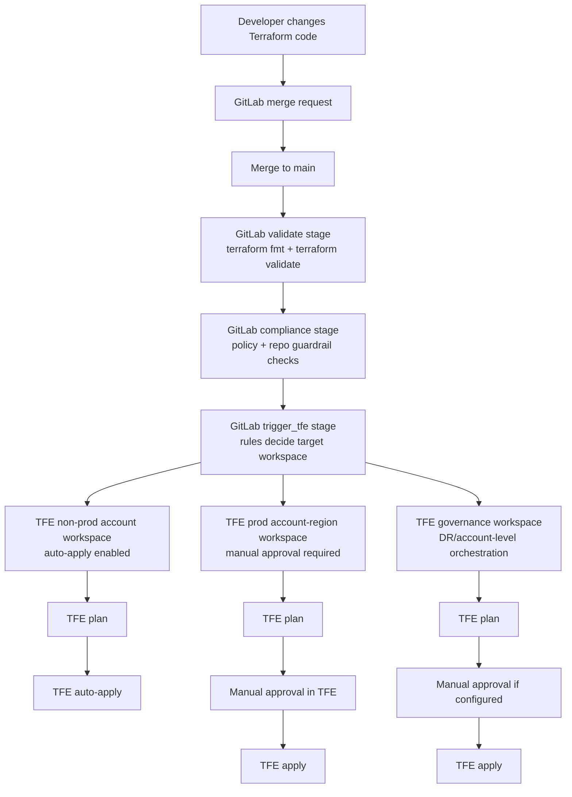
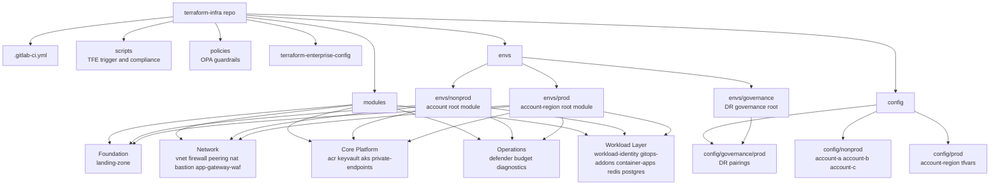
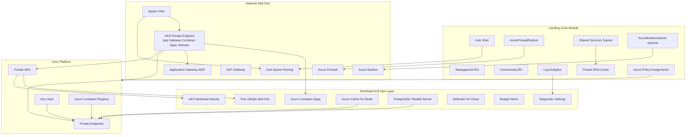
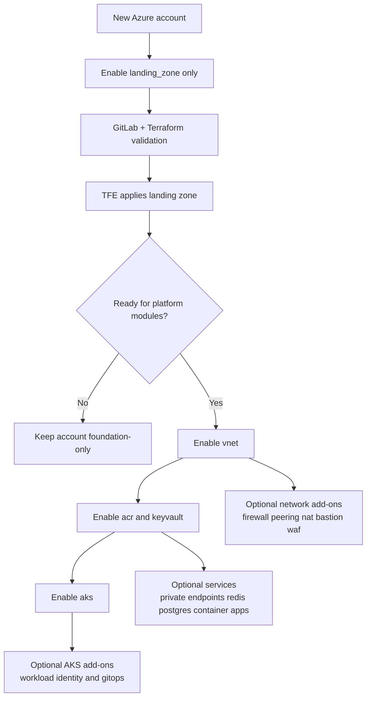
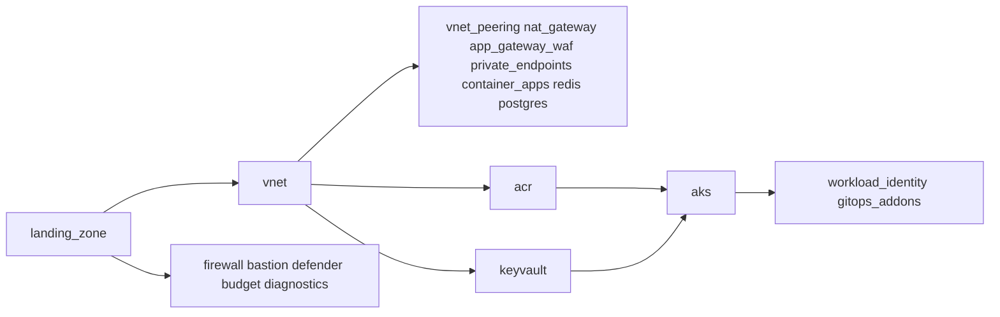
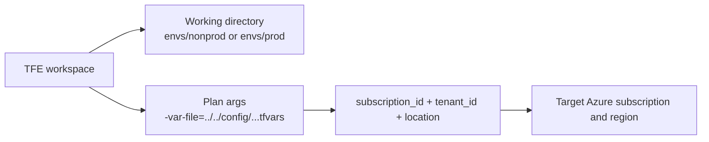
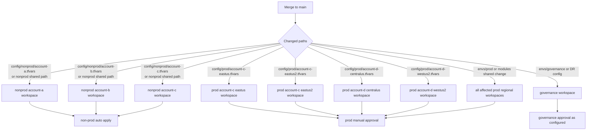

# Terraform Infra Architecture

This repository is built around one rule: GitLab validates and triggers, but Terraform Enterprise owns plan, apply, state, approval, and audit history.

## High-Level Flow



## Repository Anatomy



## Azure Resource Layering



## Workspace Model

| Scope | Workspace Pattern | Config Pattern | Apply Behavior |
|---|---|---|---|
| Non-prod | One workspace per account | `config/nonprod/account-a.tfvars` | Auto-apply after GitLab pre-flight |
| Prod platform | One workspace per account-region | `config/prod/account-c-eastus.tfvars` | TFE manual approval |
| Prod governance/DR | One workspace per prod account | `config/governance/prod/account-c-dr.tfvars` | TFE approval as configured |

Current workspaces:

```text
terraform-infra-nonprod-account-a       -> envs/nonprod + config/nonprod/account-a.tfvars
terraform-infra-nonprod-account-b       -> envs/nonprod + config/nonprod/account-b.tfvars
terraform-infra-nonprod-account-c       -> envs/nonprod + config/nonprod/account-c.tfvars
terraform-infra-prod-account-c-eastus   -> envs/prod    + config/prod/account-c-eastus.tfvars
terraform-infra-prod-account-c-eastus2  -> envs/prod    + config/prod/account-c-eastus2.tfvars
terraform-infra-prod-account-d-centralus -> envs/prod   + config/prod/account-d-centralus.tfvars
terraform-infra-prod-account-d-westus2  -> envs/prod    + config/prod/account-d-westus2.tfvars
terraform-infra-prod-account-c-governance -> envs/governance + config/governance/prod/account-c-dr.tfvars
terraform-infra-prod-account-d-governance -> envs/governance + config/governance/prod/account-d-dr.tfvars
```

## Module Enablement Guardrail

Each account config has an `enabled_modules` block:

```hcl
enabled_modules = {
  landing_zone      = true
  vnet              = false
  acr               = false
  keyvault          = false
  aks               = false
  firewall          = false
  bastion           = false
  vnet_peering      = false
  nat_gateway       = false
  app_gateway_waf   = false
  private_endpoints = false
  defender          = false
  budget            = false
  diagnostics       = false
  workload_identity = false
  gitops_addons     = false
  container_apps    = false
  redis             = false
  postgres          = false
}
```

This supports safe phased onboarding:



Guardrails:

- `aks = true` requires `landing_zone`, `vnet`, `acr`, and `keyvault`.
- `vnet`, `acr`, and `keyvault` require `landing_zone`.
- `firewall`, `bastion`, `defender`, `budget`, and `diagnostics` require `landing_zone`.
- `vnet_peering`, `nat_gateway`, `app_gateway_waf`, `private_endpoints`, `container_apps`, `redis`, and `postgres` require `landing_zone` and `vnet`.
- `workload_identity` and `gitops_addons` require `aks`.
- Critical resources use `prevent_destroy` so disabling an already-created module does not casually destroy infrastructure.
- GitLab compliance checks verify the `enabled_modules` block before triggering TFE.



## Account and Region Targeting

The Azure subscription is selected through `subscription_id` in the chosen tfvars file. The Azure region is selected through `location`.



For non-prod, one account workspace can target the account's selected primary region. For production, regional blast-radius isolation is stronger, so each prod account-region gets its own workspace and state.

## GitLab To TFE Routing



## Local Command Pattern

Do not run Terraform from the repo root. The repo root has no `.tf` files by design.

Run from a root module directory:

```bash
cd envs/nonprod
terraform init -backend=false
terraform validate
terraform plan -var-file=../../config/nonprod/account-c.tfvars
```

For a real local plan, authenticate with Azure first by installing `az` and running `az login`, or by setting `ARM_CLIENT_ID`, `ARM_CLIENT_SECRET`, `ARM_TENANT_ID`, and `ARM_SUBSCRIPTION_ID`.
